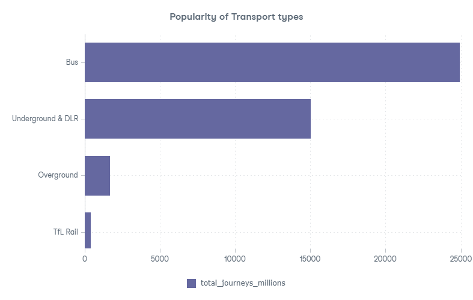
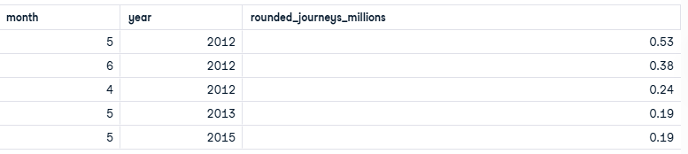
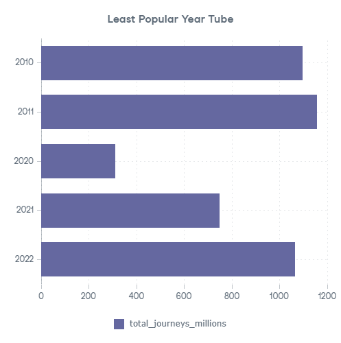

# London Public Transport Journey Analysis

## Project Overview
London operates one of the largest and most complex public transport systems in the world. This project analyzes **Transport for London (TfL)** public transport journey data to understand **usage distribution across transport modes** and **how journey volumes vary over time**.

The analysis is based on aggregated journey volumes and focuses on **descriptive insights**, not prediction or causality.

---

## Objectives
This project answers three focused analytical questions:

1. Which transport types are the most popular based on total journeys?
2. Which months recorded the highest usage of the Emirates Airline cable car?
3. Which years had the lowest Underground & DLR journey volumes?

---

## Dataset Summary
- **Source:** Transport for London (TfL)
- **Environment:** Google BigQuery
- **Table:** `TFL.JOURNEYS`
- **Metric:** Monthly journey volumes (in millions)

Each record represents the total journeys for a transport type in a given month and year.

---

## Key Insights

### 1. Most Popular Transport Types
Total journeys across all years show a **highly uneven distribution** across transport modes.

- Underground & DLR dominate overall usage with **15,020 million journeys**
- Overground usage is substantial but significantly lower
- Emirates Airline usage is minimal relative to all other modes

This indicates that **London’s transport demand is heavily concentrated in core mass-transit services**.

---

### 2. Emirates Airline Peak Usage Periods
The highest monthly journey volumes for the Emirates Airline are concentrated in **a small number of months**, primarily between **2012 and 2015**.

- Highest recorded month: **May 2012 (0.53 million journeys)**
- Peak usage is **isolated rather than consistent**
- Even peak values remain low in absolute terms

This highlights the **limited scale and episodic demand** of this transport service.

---

### 3. Lowest Underground & DLR Usage Years
Several years stand out with notably lower Underground & DLR journey volumes.

- **2020** recorded the lowest usage (310 million journeys)
- **2020–2022** form a distinct low-usage period
- Earlier low years (2010–2011) are still significantly higher than 2020

This confirms that **yearly journey volumes vary substantially** and are not stable over time.

---

## Summary of Findings
- Transport usage in London is **dominated by a single core mode**
- Some services show **very limited contribution** to overall journey volume
- Journey demand fluctuates noticeably across years

The project demonstrates how **simple aggregation and ranking** can uncover meaningful patterns in public transport data.

---

## Tools & Skills Demonstrated
- SQL (Google BigQuery)
- Data aggregation and ranking
- Time-based analysis
- Insight-driven interpretation
- Portfolio documentation

---

## Notes
This project intentionally focuses on **what the data shows**, avoiding assumptions about causation or external factors. It is designed as a **foundational data analytics portfolio project**.

---

